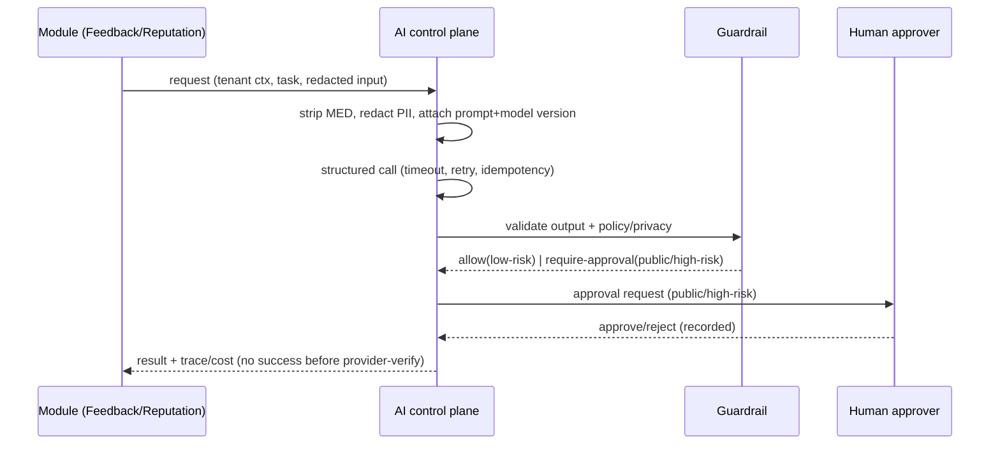

# AI Runtime Control Plane — Aish Agentic AI

**Status:** ARCHITECTURE BASELINE (Step 3) · **Application implementation: NOT STARTED.**
**Canonical:** Master Source v2.3.0 §15.2, §23–§34, §44 · PRD v1.2.0 §12, §13 · **Rules:** `.claude/rules/05`, `18`, `20` ·
**ADR:** [0019](../decisions/adr/0019-ai-provider-abstraction.md), [0020](../decisions/adr/0020-ai-service-extraction-criteria.md), [0023](../decisions/adr/0023-knowledge-base-and-tenant-scoped-retrieval.md).

The AI module is the single control plane for all model interaction. It provides, per request:
structured output (JSON Schema) · timeout · bounded retry · idempotency · redaction · guardrails · human-approval
gate · prompt version · model version · token logging · cost logging · trace correlation · failure states ·
manual fallback · kill switch.

## Agents (Master Source §23–§33)
Supervisor orchestrates specialists: Feedback Intake · Sentiment/Topic · Severity/Risk · Recovery · Google
Review Response · Policy/Privacy Guardrail · Insight · Notification. A single agent never does all work; the
supervisor never bypasses approval for sensitive actions. Only low-risk steps (classification, summary, severity
suggestion, internal assignment, SLA calc, reminders, draft creation, dup/spam detection, internal insight)
**MAY** be automated early.

## Request lifecycle (planned)

## Safety invariants
- Customer content never determines tool calls; tools allowlisted; arguments validated.
- Prohibited `MED` data never sent (`.claude/rules/18`).
- Manual fallback for every step (UC-P0-16); kill switch disables AI without breaking manual flow.
- Controlled retry never duplicates external side effects (ADR 0016).

## Assertion
No AI provider, agent, guardrail, or approval runs in Step 3. This is the planned control-plane contract.
