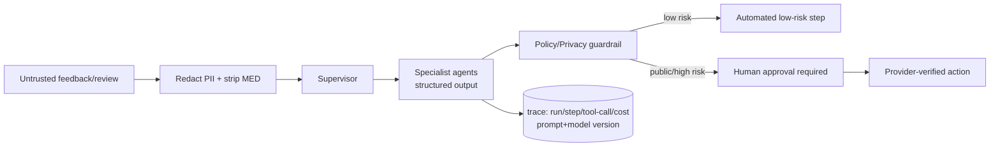

# AI Service Boundary — Aish Agentic AI

**Status:** ARCHITECTURE BASELINE (Step 3) · **Application implementation: NOT STARTED.**
**Canonical:** Master Source v2.3.0 §15.2, §23–§34, §42, §44 · PRD v1.2.0 §12, §13, §16 ·
**Rules:** `.claude/rules/04`, `05`, `18`, `20` · **ADR:** [0019](../decisions/adr/0019-ai-provider-abstraction.md), [0020](../decisions/adr/0020-ai-service-extraction-criteria.md), [0023](../decisions/adr/0023-knowledge-base-and-tenant-scoped-retrieval.md).

## 1. MVP boundary (ADR 0019)
AI is called **from Laravel** via a **provider abstraction** on a **durable queue**, only when all of these
exist: structured output (JSON Schema) · timeout · bounded retry · idempotency · prompt versioning · model
versioning · input redaction · guardrails · human approval upstream of public action · token logging · cost
logging · trace correlation · failure states · manual fallback · kill switch.

## 2. Agent architecture (Master Source §23–§33)
Supervisor + specialists: Feedback Intake, Sentiment/Topic, Severity/Risk, Recovery, Google Review Response,
Policy/Privacy Guardrail, Insight, Notification. A single agent **MUST NOT** do all work. The supervisor
**MUST NOT** bypass approval for sensitive actions. Customer content **MUST NOT** determine tool calls; tool
arguments are validated and tools allowlisted (`.claude/rules/05`).

## 3. Prohibited AI input (`.claude/rules/18`)
Diagnosis, clinical notes, medical record number, prescription/medication, odontogram, clinical imagery,
treatment-plan/history, insurance/payment-card/bank data, unredacted internal incident notes **MUST NOT** be
sent to an AI provider by default. Exceptions require privacy/security review, lawful basis, minimization, and
a Master Source update.

## 4. Knowledge / RAG (ADR 0023)
Retrieval is tenant/branch-filtered and sends only the **minimum relevant** context (Master Source §42). The
knowledge base **MUST NOT** index secrets, PII, or medical data. Cross-tenant retrieval is impossible by
construction (tenant-scoped index).

## 5. Manual fallback & kill switch
Every AI step has a manual path; core workflow works when AI is unavailable (UC-P0-16). A kill switch disables
AI actions without breaking manual operation. Controlled retry never duplicates external side effects (ADR 0016).

## 6. Service extraction criteria (ADR 0020) — NOT now
A separate Python/FastAPI AI orchestrator is split out **only** with evidence of: growing multi-agent
complexity, increasing tool calling, multiple providers, distinct AI scaling, tracing needing a separate
service, latency/concurrency need, or a security boundary need. Recorded as future criteria, not a Step 3 action.

## 7. Truthful status
No AI provider, agent, guardrail, or retrieval runs in Step 3. See
[AI Runtime Control Plane](../ai/AI_RUNTIME_CONTROL_PLANE.md), [Guardrail & Approval](../ai/AI_GUARDRAIL_AND_APPROVAL_ARCHITECTURE.md),
and [AI Observability & Cost](../ai/AI_OBSERVABILITY_AND_COST_ARCHITECTURE.md).
