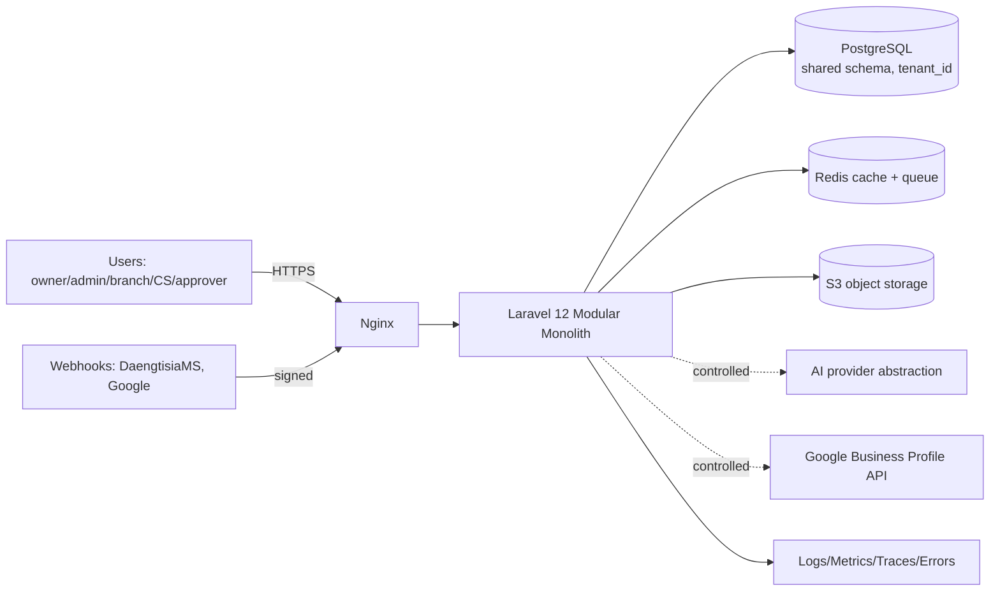

# Application Architecture Baseline — Aish Agentic AI

**Status:** ARCHITECTURE BASELINE (Step 3) · **Application implementation: NOT STARTED.**
**Canonical:** Master Source v2.3.0 §34–§42; PRD v1.2.0 §11, §22 · **Rules:** `.claude/rules/08`, `20`;
[Application Foundation Rules](APPLICATION_FOUNDATION_RULES.md) · **ADRs:** [0009](../decisions/adr/0009-laravel-modular-monolith-architecture.md)–[0032](../decisions/adr/0032-initial-deployment-topology-and-scale-path.md).

> This document defines a **planned** architecture contract. It does **not** claim any code, deployment,
> integration, pilot, or production runtime exists. All diagrams are labelled `PLANNED ARCHITECTURE — NOT DEPLOYED`.

## 1. Purpose
Fix a detailed-enough architecture contract that subsequent implementation steps do **not** need to reopen
fundamental decisions (style, tenancy, module ownership, events, API, AI boundary, operations). Every material
decision here is backed by an ADR and an enforceable rule (AFR).

## 2. Architecture style (ADR 0009)
**Laravel 12 modular monolith.** One deployable application composed of internally-bounded modules
(`app/Modules/*`) with explicit public interfaces. Rationale: fastest safe path to MVP; consistent database
transactions; simpler operations than premature microservices; native fit for multi-tenant SaaS, queues,
external integration, and human approval; extractable to services later **only** with a new ADR and evidence
of a scale/isolation/ownership need. Microservices are **not** the default.

## 3. Core runtime baseline (ADR 0009, 0018)
| Concern | Baseline |
|---------|----------|
| Backend | Laravel 12 (PHP 8.3+, production-supported) |
| Database | PostgreSQL (shared DB, shared schema, row-level tenant ownership) |
| Cache | Redis (tenant-scoped keys) |
| Queue | Redis-backed Laravel Queue (tenant context on every job) |
| Storage | S3-compatible object storage (tenant-scoped paths) |
| Web server | Nginx + PHP-FPM |
| AuthN | Laravel Fortify / Sanctum per interface |
| AuthZ | Spatie Permission + tenant/branch scope policies |
| Frontend (initial) | Blade + Tailwind CSS + Alpine.js |
| Observability | Structured logs + metrics + traces + error tracking + cost/token logging |

Dependency **patch** versions are pinned at implementation time after official compatibility is verified — **not**
locked from memory here.

## 4. Layered model (per module)
`HTTP/Console/Queue entrypoint → Request/DTO validation → Application service (command/query) → Domain →
Repository/query object → Persistence`. Cross-module calls go through **application services, contracts, or
domain events** — never direct table mutation. Tenant/branch context is resolved at the entrypoint and
propagated through every layer (ADR 0012).

## 5. Container view (planned)

## 6. Cross-cutting invariants (non-negotiable)
- **Tenant isolation** on every surface (ADR 0011, 0012, 0015) — see [Tenant Isolation Control Matrix](../security/TENANT_ISOLATION_CONTROL_MATRIX.md).
- **Human approval** for public/high-risk actions; **no review gating** (ADR 0028; `.claude/rules/06`, `18`).
- **Untrusted customer content**; prompt-injection defense + tool allowlisting (ADR 0019; `.claude/rules/04`, `05`).
- **Truthful external states**; no success before provider verification (ADR 0016, 0017; `.claude/rules/10`).
- **Idempotency + outbox + retry + dead-letter** for all external side effects (ADR 0016).
- **Manual fallback**: core workflow usable when AI/provider unavailable (ADR 0019, 0028).
- **Audit + cost + prompt/model versioning** recorded for important actions (ADR 0024, 0029).
- **Secrets never committed**; OAuth tokens encrypted (ADR 0022, 0025; `.claude/rules/04`).

## 7. Module map
Seventeen modules — see [Module Boundaries](MODULE_BOUNDARIES.md), [Module Dependency Matrix](MODULE_DEPENDENCY_MATRIX.md),
and [Data Ownership Matrix](DATA_OWNERSHIP_MATRIX.md). No module mutates another module's tables directly; the
Shared Kernel is deliberately minimal.

## 8. Related documents
Tenancy: [TENANCY_ARCHITECTURE](TENANCY_ARCHITECTURE.md) · Identity: [IDENTITY_AND_ACCESS_ARCHITECTURE](IDENTITY_AND_ACCESS_ARCHITECTURE.md) ·
Data: [DATABASE_ARCHITECTURE](DATABASE_ARCHITECTURE.md) · Events: [EVENT_DRIVEN_ARCHITECTURE](EVENT_DRIVEN_ARCHITECTURE.md),
[OUTBOX_IDEMPOTENCY_RETRY](OUTBOX_IDEMPOTENCY_RETRY.md) · API: [API_AND_WEBHOOK_STANDARDS](API_AND_WEBHOOK_STANDARDS.md) ·
AI: [AI_SERVICE_BOUNDARY](AI_SERVICE_BOUNDARY.md) · Frontend: [FRONTEND_ARCHITECTURE](FRONTEND_ARCHITECTURE.md) ·
Ops: [ENVIRONMENT_STRATEGY](ENVIRONMENT_STRATEGY.md), [DEPLOYMENT_TOPOLOGY](DEPLOYMENT_TOPOLOGY.md),
[OBSERVABILITY_ARCHITECTURE](OBSERVABILITY_ARCHITECTURE.md), [BACKUP_RESTORE_ROLLBACK](BACKUP_RESTORE_ROLLBACK.md) ·
Fitness: [ARCHITECTURE_FITNESS_FUNCTIONS](ARCHITECTURE_FITNESS_FUNCTIONS.md) · Open items: [ARCHITECTURE_OPEN_DECISIONS](ARCHITECTURE_OPEN_DECISIONS.md).

## 9. Truthful status
Architecture documentation: baseline complete on GO. Application implementation, deployment, live integration,
pilot readiness, pilot runtime, and production readiness: **NOT STARTED**.
