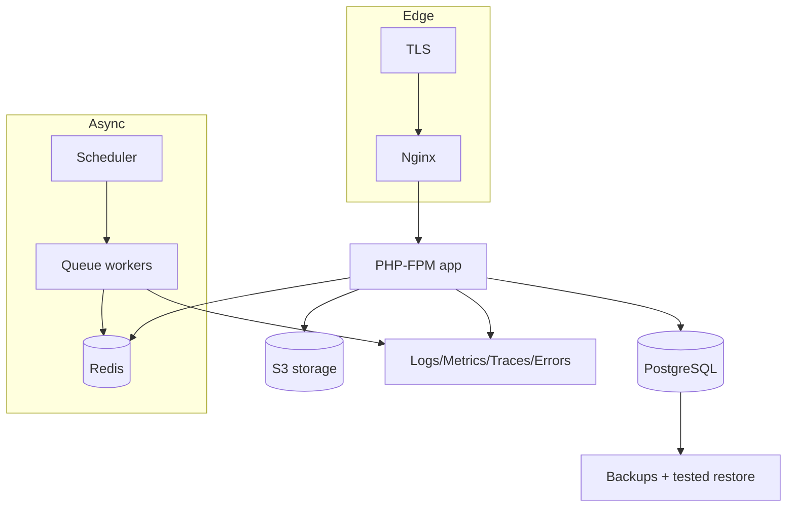

# Deployment Topology (Planned) — Aish Agentic AI

**Status:** ARCHITECTURE BASELINE (Step 3) · **Application implementation & deployment: NOT STARTED.**
**Canonical:** Master Source v2.3.0 §34, §43, §51 · **Rules:** `.claude/rules/11`, `20` ·
**ADR:** [0032](../decisions/adr/0032-initial-deployment-topology-and-scale-path.md), [0027](../decisions/adr/0027-backup-restore-rollback-disaster-recovery.md).

> Planned topology only. Nothing here is provisioned or running. No VPS, staging, pilot, or production
> deployment exists.

## 1. Components (planned, not running)
Nginx · PHP-FPM · queue workers · scheduler · PostgreSQL · Redis · S3-compatible storage · TLS termination ·
backup jobs · health checks · logging · metrics · tracing · error tracking · migration runner · rollback path.

## 2. Scale path (ADR 0032)
Start single-node app + managed/att­ached PostgreSQL + Redis. Horizontal scale path: stateless app nodes behind
Nginx, shared PostgreSQL/Redis, separate worker fleet, storage offloaded to S3. Module extraction to a service
is a **later** ADR gated by evidence (ADR 0009, 0020) — not part of the initial topology.

## 3. Operations baselines (planned)
Backup with **tested** restore, disaster recovery, incident runbook, and rollback plan exist as baselines
before any production GO (`.claude/rules/11`). Detailed in [Backup/Restore/Rollback](BACKUP_RESTORE_ROLLBACK.md),
[BACKUP_RESTORE_DR_BASELINE](../operations/BACKUP_RESTORE_DR_BASELINE.md), and
[INCIDENT_AND_ROLLBACK_BASELINE](../operations/INCIDENT_AND_ROLLBACK_BASELINE.md).

## 4. Deployment provider
**Not selected** in Step 3 (WATCH). Provider choice is a future operations decision recorded via ADR/decision
log; the shared-tenancy security baseline is provider-independent.

## 5. Architecture decision vs runtime evidence
This is an **architecture decision**. There is **no runtime evidence**: no host, container, TLS cert, or
database exists. "Deployed"/"pilot ready"/"production ready" **MUST NOT** be claimed.
