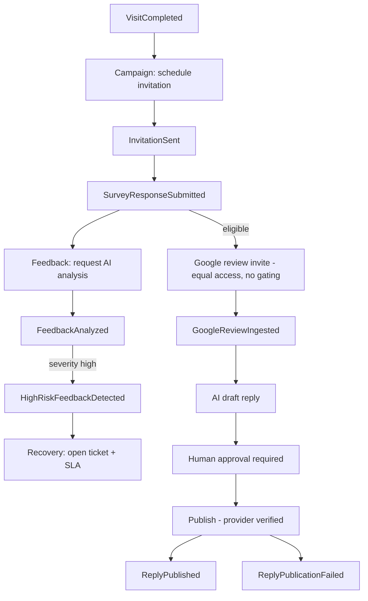

# Event-Driven Architecture — Aish Agentic AI

**Status:** ARCHITECTURE BASELINE (Step 3) · **Application implementation: NOT STARTED.**
**Canonical:** Master Source v2.3.0 §35 · **Rules:** `.claude/rules/08`, `20` ·
**ADR:** [0016](../decisions/adr/0016-domain-events-outbox-idempotency-retry-dead-letter.md) ·
See also [Event Catalog](EVENT_CATALOG.md) (Step 1) and [Outbox/Idempotency/Retry](OUTBOX_IDEMPOTENCY_RETRY.md).

## 1. Model
Modules communicate across boundaries through **domain events** carried on the Redis-backed queue, plus
synchronous contract calls where a direct answer is required. Canonical events (Master Source §35) drive the
core workflows: `TransactionCompleted`/`VisitCompleted` → `InvitationScheduled`/`Sent` →
`SurveyResponseSubmitted` → `FeedbackAnalyzed` → `HighRiskFeedbackDetected` → `RecoveryTicketOpened` →
`SLABreached`; `GoogleReviewIngested` → `ReplyApproved` → `ReplyPublished`/`ReplyPublicationFailed`;
`AgentRunFailed`, `GuardrailBlocked`.

## 2. Event envelope (mandatory)
```json
{
  "event_id": "ulid-or-uuid",
  "event_type": "SurveyResponseSubmitted",
  "event_version": 1,
  "occurred_at": "ISO-8601",
  "tenant_id": "tenant-reference",
  "branch_id": "optional-branch-reference",
  "correlation_id": "correlation-reference",
  "causation_id": "optional-causation-reference",
  "actor_type": "user|system|integration",
  "actor_id": "optional-actor-reference",
  "payload": {}
}
```
- `tenant_id` is **required** on every event; consumers rehydrate context from it (ADR 0012).
- `payload` carries **minimum necessary** data; PII minimized; **no `MED` data** ever (`.claude/rules/18`).
- `correlation_id` threads a whole workflow; `causation_id` links cause→effect for tracing/audit.

## 3. Core workflow flows (planned)


## 4. Versioning & compatibility
- Event schemas are **versioned** (`event_version`); consumers tolerate additive fields.
- A breaking change publishes a new version and a documented migration/replay path — never a silent reshape.

## 5. Delivery guarantees
- Publication uses the **transactional outbox** so events survive commit (ADR 0016).
- Consumers are **idempotent** (dedupe on `event_id`); retry with backoff; poison messages go to dead-letter;
  replay is supported and audited (see [Outbox/Idempotency/Retry](OUTBOX_IDEMPOTENCY_RETRY.md)).

## 6. Truthful status
No event bus, consumer, or workflow runs in Step 3. These are the contracts implementation must satisfy.
