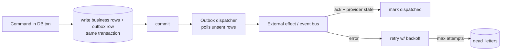

# Outbox, Idempotency, Retry, and Dead-Letter — Aish Agentic AI

**Status:** ARCHITECTURE BASELINE (Step 3) · **Application implementation: NOT STARTED.**
**Canonical:** Master Source v2.3.0 §35, §39 · **Rules:** `.claude/rules/05`, `08`, `10`, `20` ·
**ADR:** [0016](../decisions/adr/0016-domain-events-outbox-idempotency-retry-dead-letter.md), [0017](../decisions/adr/0017-public-api-and-webhook-contracts.md).

Every external side effect (send invitation, publish reply, call AI provider, deliver webhook, meter usage)
**MUST** be idempotent, retry-safe, auditable, provider-state verified, correlated, protected from duplicate
execution, and carry a truthful status. Owned by the Integration module.

## 1. Transactional outbox

- Business change and its outbound intent are written in **one transaction** → no lost or phantom effects.
- The dispatcher is the only component performing the external call; it records provider response before
  marking success (**no success before provider verification**, `.claude/rules/10`).

## 2. Idempotency
- Producers assign a stable `event_id`/`idempotency_key`; consumers and providers dedupe on it.
- Retried dispatch **MUST NOT** create a duplicate invitation, ticket, reply, charge, or webhook (ADR 0016).
- Public API accepts an `Idempotency-Key` header for unsafe operations (ADR 0017).

## 3. Retry policy
- Bounded attempts with exponential backoff + jitter; per-effect `max_attempts` configured.
- Transient vs permanent errors classified; permanent errors skip retry and dead-letter immediately.
- A **kill switch** halts a class of external effects without data loss (outbox rows remain, resumable).

## 4. Dead-letter & replay
- Exhausted/poison messages move to `dead_letters` with full envelope + failure reason.
- Replay is explicit, authorized, idempotent, and audited; it re-uses the original `event_id` (no duplication).

## 5. Truthful external state vocabulary
Webhook/effect states: `Pending → Delivering → Delivered | Retry Scheduled | Failed | Dead Lettered |
Cancelled`. Reply states: `no draft → draft generated → under review → changes requested → approved →
publishing → published | publication failed | policy issue | moderation pending | removed`. A failed publish
keeps a truthful failure state; a mock/unavailable provider is **not** reported as integration success
(`.claude/rules/18`).

## 6. Truthful status
No outbox, dispatcher, or retry loop runs in Step 3. This is the contract implementation must satisfy; fitness
functions `FF-REL-01..06` assert its presence at implementation time.
