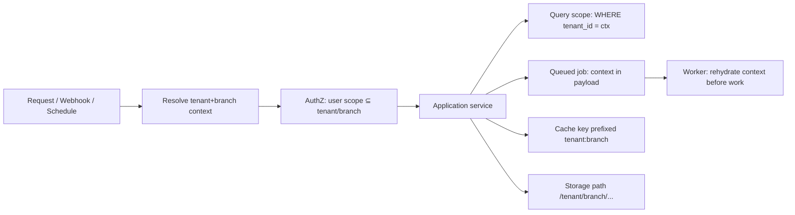

# Tenancy Architecture — Aish Agentic AI

**Status:** ARCHITECTURE BASELINE (Step 3) · **Application implementation: NOT STARTED.**
**Canonical:** Master Source v2.3.0 §15.1, §17, §37 · **Rules:** `.claude/rules/03`, `20` ·
**ADR:** [0011](../decisions/adr/0011-shared-database-shared-schema-multi-tenancy.md), [0012](../decisions/adr/0012-tenant-and-branch-context-propagation.md), [0015](../decisions/adr/0015-queue-cache-storage-search-export-analytics-isolation.md).

## 1. Topology (ADR 0011)
**Shared PostgreSQL database, shared schema, row-level tenant ownership** for the initial SaaS tiers. Every
tenant-owned record carries `tenant_id`; branch-relevant records carry `branch_id`. Dedicated enterprise
environments are a **future option** and do not replace the shared-tenancy security baseline. PostgreSQL
Row-Level Security (RLS) **MAY** be evaluated as defense-in-depth — **not** claimed as implemented in Step 3
(see [Open Decisions](ARCHITECTURE_OPEN_DECISIONS.md)).

## 2. Context propagation (ADR 0012)
Tenant/branch context is resolved once at the entrypoint and carried explicitly end-to-end:

- The context object is immutable per request and **MUST** be present before any data access.
- Background jobs, schedulers, and event consumers **MUST** carry and rehydrate tenant context (no ambient default).
- A missing/mismatched context is a hard failure, never a silent fallback to "all tenants".

## 3. Isolation surfaces (ADR 0015) — all mandatory
DB queries · cache keys · queue jobs · file storage paths · search indexes · exports · public API · webhooks ·
AI retrieval · knowledge retrieval · analytics/read-models · notifications · tenant-facing logs · test suite ·
architecture fitness functions. Each surface is enumerated with its control in
[Tenant Isolation Control Matrix](../security/TENANT_ISOLATION_CONTROL_MATRIX.md).

## 4. Branch scoping
Branch-scoped roles (e.g. Branch Manager, Recovery Assignee) see **only** their branch's data. Branch scope is
enforced in the authorization layer and re-applied at the query layer (defense-in-depth), not just in the UI.

## 5. Enforcement (not prose alone)
- Global query scope + explicit repository scoping (belt-and-suspenders).
- DB constraints: composite unique keys and FKs include `tenant_id` (cross-tenant collision impossible).
- Fitness functions `FF-TEN-01..14` assert a control exists per surface (see [Fitness Functions](ARCHITECTURE_FITNESS_FUNCTIONS.md)).
- Security tests (planned) cover cross-tenant access, IDOR, queue-context loss, cache/storage collision,
  search/export/AI-retrieval leakage ([STEP_3_THREAT_MODEL](../security/STEP_3_THREAT_MODEL.md)).

## 6. Truthful status
No tenant data, RLS policy, or isolation test executes in Step 3. This is the **planned** contract that
implementation and its tests must satisfy before any release gate can pass.
