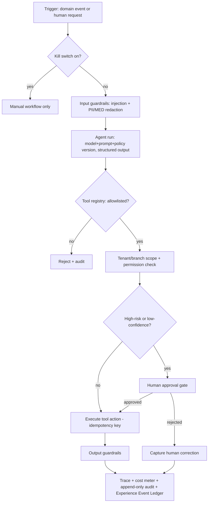

# AI Tool Permission & Human-Approval Architecture (Step 9 Design Baseline)

**Status:** DESIGN BASELINE — NOT IMPLEMENTED
**Sprint:** Step 9 — Competitive Gap Audit & Architecture Re-baseline
**Owner domain:** AI Orchestration & Tool Actions
**Related:** ADR 0067 (AI tool permission, human approval, cost ceiling, tracing, kill switch), rule 34,
AFR-230..AFR-234
**Canonical repo:** makemesick91-code/aish_agentic_ai

> AI orchestration and Agent Studio are **NOT STARTED**. This is the bounded-action contract that any future AI runtime
> must satisfy. It restates and operationalizes the permanent AI-governance rules; it does not relax them.

---

## 1. Binding governance (this design must comply)

- Rule 05 (`.claude/rules/05-ai-governance-and-human-approval.md`): supervisor + specialist agents (a single agent
  must not do all work); human approval for Master Source §33 / PRD §13 triggers; structured output; **customer
  content MUST NOT determine tool calls**; tool args validated + allowlisted; tracing, prompt-version, model-version,
  and cost logging mandatory; workflow usable when AI is unavailable; kill switch + controlled retry with no duplicate
  external side effects.
- Rules 18/04/06: MED data MUST NOT reach an AI provider or public output; feedback/reviews are untrusted input
  (prompt-injection defense); every Google Review reply requires recorded human approval; anti-gating permanent.
- Reuse: usage metering `app/Models/UsageRecord.php`; append-only audit `app/Models/AuditLog.php`; SF-05 dispatcher;
  Human Approval Matrix `docs/ai/HUMAN_APPROVAL_MATRIX.md`; AI evaluation baseline `docs/ai/AI_EVALUATION_BASELINE.md`.
- Feedback free text is deliberately NOT AI-fed as of Step 8 (rule 33) — basic AI over feedback is a Wave-1 change
  under this contract.

---

## 2. Control-plane flow

Manual workflows remain fully operable at every branch of this diagram; disabling AI never disables basic functions.

---

## 3. Required contract

### 3.1 Model / provider abstraction
- Providers are swappable behind an abstraction; no vendor lock. Structured output is enforced and schema-validated;
  invalid output is rejected and retried (bounded), never silently accepted.

### 3.2 Versioning & identity
- Each run records: agent identity + version, prompt version, policy version, model + model version. Prompt and policy
  versions are immutable once used.

### 3.3 Tool registry & permission
- Tools are explicit, typed, and allowlisted; no dynamic/arbitrary tool creation. Each tool is gated by a specific
  permission (least privilege) and carries validated tenant/branch context on every call; a tool never crosses tenant
  boundaries.

### 3.4 Data minimization
- Only the minimum tenant/branch-filtered context reaches a model. MED data is excluded. RAG retrieval is
  tenant/branch-scoped (rules 05/07); knowledge never leaks across tenants.

### 3.5 Allowlist & forbidden actions
- Explicit forbidden set: public reply publication, refunds/discounts/compensation, data deletion, legal statements,
  and admissions of fault are **never** auto-executed — they require recorded human approval.

### 3.6 Confidence, approval thresholds, high-risk mandatory approval
- A confidence threshold routes low-confidence output to human review. High-risk triggers (Master Source §33 / PRD
  §13) **mandate** approval regardless of confidence: 1–2 star reviews; legal/medical/safety/fraud/discrimination
  risk; PII; refunds/discounts/compensation; data deletion; legal statements; low AI confidence; policy conflict;
  admission of fault; repeated customer contact.

### 3.7 Cost ceiling & metering
- Hard per-tenant, per-agent, and per-run cost ceilings; on breach the run stops. Token and outcome metering is
  recorded via `app/Models/UsageRecord.php` (tenant-scoped, idempotent).

### 3.8 Timeout, retry, duplicate-action prevention
- Bounded timeouts and controlled retry that **never** duplicates an external side effect. Every side-effecting tool
  action carries an idempotency key.

### 3.9 Correlation & trace
- Every run has a trace id; every tool call is logged and correlated; runs and actions are projected to the Experience
  Event Ledger (`docs/architecture/experience-os/EXPERIENCE_EVENT_LEDGER.md`) for cross-domain history.

### 3.10 Guardrails & prompt-injection defense
- Input and output guardrails record pass/fail. Customer content (feedback, reviews, messages) is untrusted and can
  **never** steer tool calls or escalate privileges (rules 04/05).

### 3.11 PII & healthcare privacy
- Redaction before any provider call; MED-classified data never sent to a provider or into public output (rule 18).

### 3.12 Kill switch
- Global, per-tenant, and per-agent kill switches disable autonomous action instantly and fall back to manual.

### 3.13 Rollback / compensating action
- Every external side-effecting tool has a compensating/rollback path or is approval-gated before execution.

### 3.14 Human correction capture
- Human edits, approvals, and rejections are recorded and feed the evaluation dataset.

### 3.15 Evaluation dataset & quality gates
- An adversarial evaluation dataset (prompt injection, PII, sarcasm, mixed language) with thresholds; the AI release
  gate confirms no PII leakage on the suite, valid structured output, active human approval, cost limit, kill switch,
  and idempotent retry (rule 09; `docs/ai/AI_EVALUATION_BASELINE.md`).

---

## 4. Reliability-before-autonomy invariant

Autonomy is earned, not defaulted: manual → semi-automated → approved automation → limited autonomy (rules 02/05).
Only low-risk steps (classification, summary, severity suggestion, internal assignment, SLA calc, reminders, draft
creation, duplicate/spam detection, internal insight) may be automated early. Agentic tool execution (Agent Studio) is
a **Wave 3** capability, sequenced after basic AI (Wave 1) and human-approval flows are stable.

## 5. Out of scope for Step 9

No agent, tool, model call, or approval workflow is implemented in Step 9. This contract governs Wave-1 basic AI and
Wave-3 Agent Studio when they are built. Deployment/pilot/production remain NOT STARTED.
