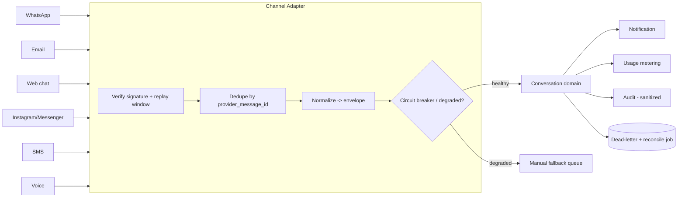

# Provider-Neutral Channel Adapter Architecture (Step 9 Design Baseline)

**Status:** DESIGN BASELINE — NOT IMPLEMENTED
**Sprint:** Step 9 — Competitive Gap Audit & Architecture Re-baseline
**Owner domain:** Conversation & Channel Adapter
**Related:** ADR 0066 (Provider-neutral Channel Adapter architecture), rule 34, AFR-225..AFR-229
**Canonical repo:** makemesick91-code/aish_agentic_ai

> Omnichannel conversations are **NOT STARTED**. This document is the provider-neutral contract that a future Wave 2
> implementation must satisfy. It reuses, and must not weaken, the implemented notification, storage, usage, and audit
> foundations.

---

## 1. Existing foundation (reuse, do not replace)

- Outbound notification foundation (SF-05): single dispatcher `app/Services/Notifications/`,
  `app/Models/NotificationDelivery.php` (truthful states, per-(recipient,channel) globally-unique dedup, bounded
  idempotent retry, in-app + email only), `app/Models/NotificationPreference.php` (timezone-aware quiet hours,
  critical bypass), mail adapter `app/Mail/`.
- Private attachment handling with content-based MIME validation: `app/Feedback/FeedbackAttachmentService.php`.
- Usage metering `app/Models/UsageRecord.php`; append-only audit `app/Models/AuditLog.php`.
- Secret/credential rules: rules 04/24 (encryption at rest; no plaintext refresh tokens; per-environment secrets);
  Google OAuth/token rules 06. There is currently **no inbound message handling and no conversation model**.

---

## 2. Provider-independent conversation model

Two owned aggregates isolate provider details from the domain:

- `channel_connections` — a tenant-scoped connection to one provider account (encrypted credentials, rotation
  metadata, status). No connection is shared across tenants.
- `conversations` + `messages` — a normalized, provider-independent thread. Provider-specific fields live only in the
  adapter's translation layer; the domain sees a normalized envelope: `{ tenant_id, branch_id?, conversation_id,
  message_id, direction, subject_customer_ref?, channel, provider, provider_message_id, occurred_at, recorded_at,
  content_ref, delivery_state }`.

---

## 3. Required contract

### 3.1 Connection & credential ownership
- Credentials are tenant-owned, encrypted at rest; refresh tokens never stored in plaintext; OAuth state validated;
  rotation + revocation supported and documented. No environment inherits another's secrets (rule 24).

### 3.2 Inbound message identity
- Every inbound message is deduplicated by `(tenant_id, provider, provider_message_id)`; a replayed webhook resolves
  to the same message with no duplicate side effect.

### 3.3 Outbound request identity
- Outbound sends carry a client-generated idempotency key; the provider message id is captured on acknowledgement.
  Re-sending with the same idempotency key is a no-op.

### 3.4 States (truthful)
- `queued`, `sent` (provider accepted), `delivered`, `read`, `failed` (sanitized failure code), `moderation`
  (provider held), `unknown`. Provider acknowledgement is **not** proven end-user receipt — mirrors
  `NotificationDelivery` truthfulness. A failed send keeps a truthful failed state; no success is shown before
  provider confirmation.

### 3.5 Webhook authentication & replay protection
- Provider webhooks are signature-verified against a per-tenant secret; unsigned or mismatched payloads are rejected.
  A timestamp + nonce window prevents replay; duplicates are dropped.

### 3.6 Idempotency, rate limits, retry/backoff
- Idempotent inbound and outbound. Per-provider and per-tenant rate limits. Bounded exponential backoff with a
  dead-letter queue for exhausted retries.

### 3.7 Reconciliation jobs
- Scheduled jobs poll provider status to resolve `unknown`/pending states and reconcile the ledger; safe to rerun
  (idempotent).

### 3.8 Attachment security
- Inbound/outbound attachments use private tenant-prefixed storage with content-based MIME validation and no public
  disk — the same guarantees as `app/Feedback/FeedbackAttachmentService.php`. User-supplied names are never a path
  segment (no traversal).

### 3.9 Cost metering
- Per-message cost is recorded as tenant-scoped, idempotent usage via `app/Models/UsageRecord.php`; a retry never
  double-counts; cost is entitlement/plan-aware.

### 3.10 Quiet hours & consent
- Outbound respects tenant/customer consent, timezone-aware quiet hours, opt-out, and the anti-spam frequency caps of
  rule 17. Critical security notifications may bypass preferences (SF-05 semantics).

### 3.11 Tenant & branch routing
- Inbound messages route to the correct tenant/branch by connection ownership; a message is never routed
  cross-tenant. Branch-restricted users see only their branch's conversations.

### 3.12 Provider degradation & circuit breaker
- A per-provider circuit breaker opens on sustained failure and falls back to the manual workflow. **A single
  provider's failure MUST NOT break Feedback Operations or Customer Recovery** — those domains keep operating on their
  own data.

### 3.13 Audit trail
- Sanitized audit only: no message bodies, PII, medical data, secrets, or tokens in audit metadata.

### 3.14 Adapter testing contract
- Each adapter ships contract tests against a fake provider double; CI never calls a live provider. A mock is **not**
  integration success — a real integration claim requires provider verification evidence (rule 18; Master Source
  §15.7/§53).

---

## 4. Review-policy preservation

Channel routing MUST NOT be used to gate, hide, or steer Google Review access; anti-gating is permanent (rules 06/18).
Sensitive cases are routed to a private channel, never suppressed.

---

## 5. Out of scope for Step 9 / sequencing

No adapter, conversation model, provider credential, or webhook endpoint is implemented in Step 9. Omnichannel is a
**Wave 2** capability, sequenced after Customer 360 (Step 10) and the Recovery/AI Wave-1 foundations, because inbound
conversations depend on a customer identity to attach to and on the Experience Event Ledger for cross-domain history.
