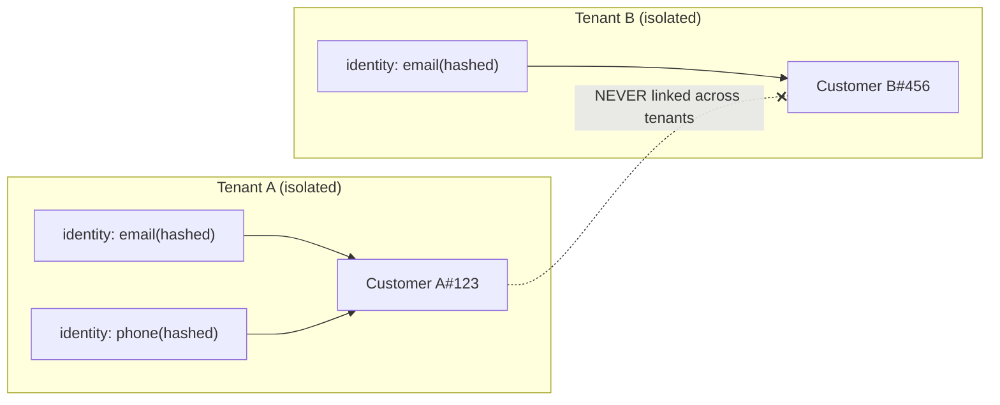
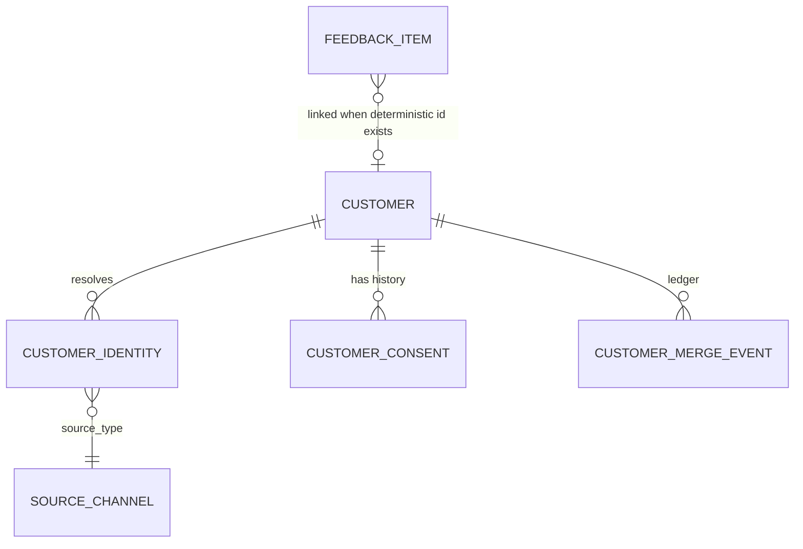
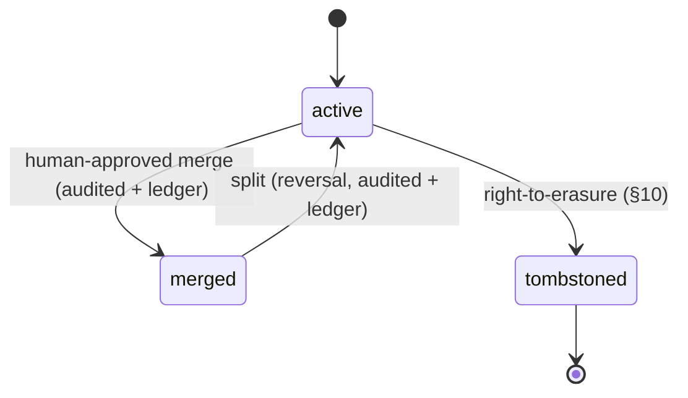
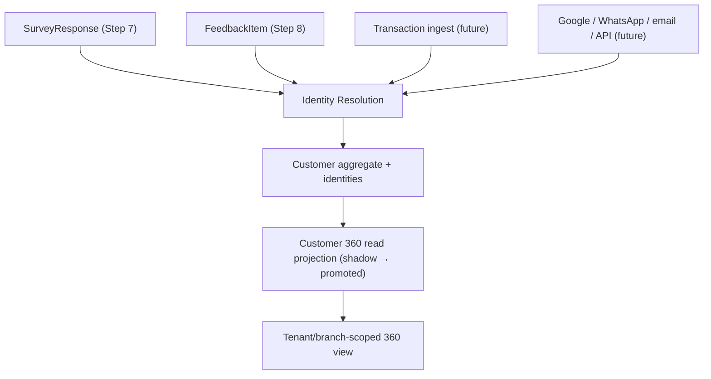

# Customer Identity & Customer 360 Architecture (Step 9 Design Baseline)

**Status: DESIGN BASELINE — NOT IMPLEMENTED**
**Sprint: Step 9 (Competitive Gap Audit & Architecture Re-baseline)**
**Owner domain: Customer Profile & Identity Resolution**
**Related: ADR 0064 (Unified Customer Identity & Customer 360 ownership), rule 34, AFR-215..AFR-219**
**Canonical repo: makemesick91-code/aish_agentic_ai**

> This document is a DESIGN/GOVERNANCE artifact for a design/re-baseline sprint. It defines the
> target architecture for a unified, tenant-scoped Customer identity and a Customer 360 read model.
> No production entity, migration, or application code is delivered by Step 9. Customer 360
> production implementation is **NOT STARTED** and is scheduled to land in **Step 10**. Every rule
> below is binding on the Step 10 implementation but **MUST NOT** be read as already built.

---

## 1. Purpose and scope

Step 8 delivered an operable Feedback Inbox, but feedback items reference only their **source**
(a survey response), not a durable customer. There is today **no `Customer` entity, no identity
resolution, and no transaction ingestion** in the repository. Analysts cannot answer "show me
everything we know about this customer across surveys, feedback, and (future) transactions,
Google, and WhatsApp." This is the competitive gap this design closes.

This baseline specifies:

- A canonical, tenant-scoped `Customer` aggregate owned by a **Customer Profile & Identity
  Resolution** domain.
- Source-identity capture and deterministic/probabilistic identity resolution with
  human-approved merge/split.
- Consent and communication-preference history.
- Anonymous-response handling, duplicate prevention, deletion/retention.
- An additive, idempotent backfill of existing Step 8 data.
- A Customer 360 read model and its performance/isolation strategy.

**In scope for Step 9:** the design contract only. **Out of scope for Step 9:** all code (§16).

## 2. Existing foundation (already IMPLEMENTED — build on, do not re-implement)

| Capability | Source of truth (existing) |
|---|---|
| Global user identity (no `tenant_id` on users) | `app/Models/User.php` |
| Tenant access only via active membership | `app/Models/TenantMembership.php` |
| Tenants / branches / branch access | `app/Models/Tenant.php`, `app/Models/Branch.php`, `app/Models/BranchAccessGrant.php` |
| Immutable fail-closed tenant context | `app/Tenancy/` |
| Public survey responses (anonymous by default; hashed one-time tokens; **no** customer created) | `app/Models/SurveyResponse.php`, `app/Models/SurveyInvitation.php` |
| Idempotent feedback projection with DB unique `(tenant_id, source_type, source_id)` | `app/Feedback/FeedbackProjector.php`, `app/Models/FeedbackItem.php` |
| Append-only timeline / append-only audit | `app/Models/FeedbackEvent.php`, `app/Models/AuditLog.php` |

The Customer domain **reuses** the tenant/branch context, the append-only `AuditLog`, the
notification-preference substrate, and the entitlement resolver. It **adds** a new bounded context;
it does not modify feedback projection semantics.

## 3. Canonical customer identity ownership

- A new `Customer` aggregate is the **single** canonical representation of a person a tenant has a
  relationship with. It is owned exclusively by the Customer Profile & Identity Resolution domain;
  no other module writes `customers` or `customer_identities` (cross-module access is via a read
  contract / domain event, per rule 20).
- Planned `customers` table (design shape — not a migration): `id` (internal BIGINT/ULID PK),
  `tenant_id` (**required**, FK, every row), `public_id` (ULID, opaque, the only external route
  key), `branch_id` (**nullable** — *provenance only*: the branch where the customer was first
  seen; it does **not** restrict which branches may interact with the customer), `display_name`
  (nullable, minimized), `status` (`active` / `merged` / `tombstoned`), `first_seen_at`,
  `last_seen_at`, timestamps.
- A `Customer` is a durable identity, **not** an account/login. It never grants application access,
  RBAC, or platform access. It is distinct from `User` (global operator identity) and from a public
  survey respondent.

## 4. Tenant scoping — cross-tenant identity PROHIBITED

- Every customer identifier is **tenant-scoped**. All identity keys, deterministic match indexes,
  and read-model queries carry `tenant_id`. There is no global customer namespace.
- Cross-tenant identity resolution is **PROHIBITED**: the system **MUST NEVER** merge, link,
  suggest, or aggregate a customer across two tenants, even when the same email/phone appears in
  both. The same real person in Tenant A and Tenant B is two independent `Customer` rows that are
  never associated. This is a permanent, release-blocking invariant (rules 03, 30).

## 5. Source identities (`customer_identities`)

Each observable identifier a customer presents through a channel is a **source identity** row,
distinct from the `Customer` it resolves to. Planned shape:

- `tenant_id` (required), `customer_id` (FK, nullable until resolved), `public_id` (ULID).
- `source_type` — enum: `survey`, `transaction`, `google`, `whatsapp`, `email`, `api`, plus
  reserved room for future channels.
- `source_value` — the identifier, **normalized** (§8) and, for PII types (email, phone), stored
  as a keyed **hash** for deterministic matching; a minimized display form is stored separately and
  is subject to erasure (§10).
- `provenance` — captured origin (e.g. survey campaign id, transaction ingest batch, API caller),
  no free-text customer content, no medical data.
- `confidence` (§6), `link_method` (`deterministic` / `probabilistic` / `manual`),
  `first_seen_at`, `last_seen_at`.

Source identities are **append-observed**: a repeated observation updates `last_seen_at`
idempotently and never creates a duplicate for the same `(tenant_id, source_type, normalized+hashed
source_value)`.

## 6. Identity-link confidence and provenance

- Every link between a source identity and a `Customer` carries a **confidence** and a
  **provenance** record. Two link classes exist:
  - **Deterministic** — an exact match on a **normalized** strong identifier (email or phone hash)
    within the tenant. Deterministic links **MAY** auto-attach a source identity to an existing
    customer (or create the customer) because they cannot silently merge two *existing* customers
    (see §7 for the merge boundary).
  - **Probabilistic** — a similarity signal (fuzzy name + partial contact, shared device, etc.).
    Probabilistic results are **SUGGESTIONS ONLY**. They **MUST NEVER** be auto-applied, never
    mutate a customer, and are surfaced to an authorized human for review.
- Confidence, method, and the evidence summary are recorded so every link is explainable and
  auditable. No probabilistic score alone may cause a destructive change.

## 7. Merge and split — human-approved, reversible, audited

- **Merging two existing customers is a human-approved action ONLY.** There are **NO silent
  destructive merges**. A deterministic collision between two *already-materialized* customers
  raises a review task; it does not auto-merge.
- A merge selects a surviving customer and one or more merged customers; source identities,
  consent history, and interaction links repoint to the survivor. The merged customer moves to
  status `merged` and is retained (not deleted) so the operation is **reversible**.
- **Split** reverses a merge (or separates wrongly-linked identities) by restoring the affected
  customer(s) from the recorded pre-merge state.
- Every merge and split writes **two** immutable records: (a) an entry in the append-only
  `app/Models/AuditLog.php` (actor + tenant, sanitized, no PII/medical/free-text content), and
  (b) a domain-specific append-only `customer_merge_events` ledger capturing before/after identity
  membership sufficient to reverse the operation. The ledger is append-only (no `updated_at`;
  update/delete blocked at the model layer), matching the timeline/audit discipline of Step 8.

## 8. Duplicate prevention and normalization

- A **unique deterministic identity key per tenant** prevents duplicates: a DB unique constraint on
  `(tenant_id, source_type, normalized_hashed_source_value)` for strong identifiers. A concurrent
  double-observe resolves to one row (upsert / insert-ignore), mirroring the idempotency guarantee
  of feedback projection.
- **Normalization rules (canonical, versioned):** email → trim, lowercase, strip display name,
  reject invalid; phone → E.164 using tenant default region, strip spacing/punctuation; name → trim
  + collapse whitespace (used only for probabilistic suggestions, never as a unique key). The
  normalization ruleset is versioned so historical matches remain explainable when rules evolve.

## 9. Cross-branch identity behavior

- One `Customer` may be observed at **multiple branches** within the same tenant. The customer is a
  tenant-level identity; `branch_id` on the customer is provenance only.
- **Branch-restricted users see only their branch's interactions.** The Customer 360 read model
  filters the *interaction timeline* (surveys, feedback, future transactions) by the viewer's branch
  scope using the existing `BranchAccessGrant` / tenant-context rules. A branch-restricted operator
  may see that a customer exists at the tenant level (if policy permits) but **MUST NOT** see
  interactions from branches outside their grant. Aggregate 360 counts respect the same scope.

## 10. Anonymous feedback, deletion, and retention

- **Anonymous responses MUST NOT silently create a customer identity.** Preserving Step 7/8
  semantics: an anonymous survey response has no strong identifier; it stays **unlinked** and never
  fabricates a `Customer`. **An IP address is NOT an identity** and is never used as an identity key.
  A customer is created only when a deterministic strong identifier is present or a human explicitly
  associates the interaction.
- **Right-to-erasure:** deletion is a **tombstone + PII purge**, not a hard row delete. On erasure
  the customer status becomes `tombstoned`, PII fields and hashed strong identifiers are purged, and
  only **aggregate, non-identifying counts** (e.g. number of past interactions) are retained so
  historical metrics remain correct. The tombstone and the erasure action are audited.
- **Retention is configurable** per tenant (rule 07). Free-text answer content is never copied into
  identity records; medical data never enters identity records (§13).

## 11. Backfill strategy for existing Step 8 data

- Backfill is **additive, idempotent, queued, resumable, and non-destructive.** It never mutates
  feedback projection, survey responses, or audit history.
- For each existing `FeedbackItem` / `SurveyResponse`, the backfill inspects the source for a
  **deterministic** strong identifier (e.g. a verified email/phone captured on the response). Where
  one exists, it creates/attaches a `Customer` and links the feedback item to that customer. Where
  **no** deterministic identity exists (the common anonymous case), the item **remains unlinked** —
  no probabilistic guessing during backfill.
- Backfill is chunked and checkpointed so a re-run resumes without duplicating links (guarded by the
  same unique identity key). It emits progress to the timeline/audit, not customer content.

## 12. Reconciliation, rollback, and shadow read-model

- A future console command **`aish:customer-reconcile`** (design placeholder) re-derives the
  Customer 360 read projection and reconciles identity links idempotently, safe to rerun, emitting
  each corrective transition at most once — mirroring `aish:feedback-reconcile` discipline.
- Rollback: because merges/splits are ledger-backed (§7) and backfill is non-destructive (§11), any
  incorrect link can be reversed from recorded state without data loss.
- A **shadow read-model** is built and validated in parallel before it is trusted for UI: the
  projection runs, is compared against source-of-truth aggregates, and is promoted only when
  consistent. This avoids exposing a half-built 360 view.

## 13. Read-model and performance strategy (Customer 360)

- Customer 360 is a **read projection** (`customer_360` shadow/read tables or materialized views)
  assembled from the customer, its identities, consent history, and interaction sources. Writes go
  to owning domains; the 360 view is read-optimized and rebuildable via reconcile.
- **Tenant-scoped queries only** — every 360 read carries `tenant_id`; branch scope is applied to
  interactions (§9). No cross-tenant aggregation, ever.
- **No N+1 across domains:** the projection pre-joins/denormalizes counts and last-interaction
  timestamps; indexes on `(tenant_id, public_id)`, `(tenant_id, source_type, hashed_value)`, and
  `(tenant_id, branch_id, last_seen_at)`. Heavy assembly runs off the request path (queued) with the
  read model serving the UI.

## 14. Consent and communication-preference history

- Consent and communication preferences are recorded as a **versioned, append-only history**
  (`customer_consent`), each entry carrying the consent-text version and an explicit
  accepted/rejected boolean — never a default-accepted or pre-checked value.
- **Survey completion is NOT marketing consent** (preserving rules 32 and 17). A completed response
  never implies communication consent; consent is a separate, explicit, versioned capture.
- Preference history ties into the existing notification-preference substrate so that future
  outbound messaging honors the latest consent state fail-closed (no consent → no marketing send).

## 15. Healthcare privacy

- Identity records **MUST NEVER** contain diagnosis, clinical notes, medical record numbers,
  prescriptions, odontograms, clinical media, treatment narratives, or insurance/payment-card data
  (rule 18). Source-identity `provenance` and consent entries are limited to non-clinical metadata.
- Free-text answer content is never copied into identity records; medical data is never a match key
  and is never sent to any resolver, AI provider (Step 8/9 forbid AI on this data), or public output.

## 16. Out of scope for Step 9 / what Step 10 implements

**Out of scope for Step 9 (this sprint delivers NO code):** any migration, model, controller, job,
command, or read-model table; transaction ingestion; Google/WhatsApp/email/API channel connectors;
the `aish:customer-reconcile` command; probabilistic scoring implementation; the merge/split UI.

**Step 10 (Customer 360 production implementation — NOT STARTED) will implement:** the `customers`,
`customer_identities`, `customer_consent`, and `customer_merge_events` tables with `tenant_id` on
every row and ULID public ids; deterministic resolution + duplicate-prevention constraints;
human-approved merge/split with append-only ledger + audit; the additive idempotent queued backfill;
`aish:customer-reconcile` and the shadow read-model; the tenant/branch-scoped Customer 360 read
projection; consent history wiring; right-to-erasure tombstoning; and the full cross-tenant /
cross-branch / anonymous-no-identity / no-medical-data test matrix, gated by the standard
clean-checkout verification and release gates (rules 09, 13, 28, 29).

**Truthful status:** Customer 360 is `DESIGN — NOT IMPLEMENTED`; production implementation is
`NOT STARTED`. This design baseline attests architecture readiness only.
