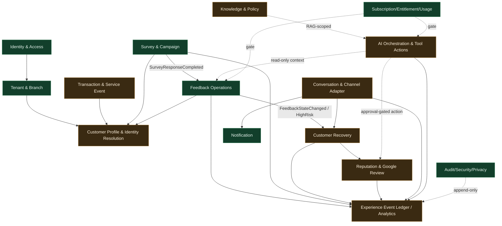

# Agentic Experience OS — Domain Boundary & Source-of-Truth Map (Step 9 Lock)

**Status:** ARCHITECTURE LOCK — governance baseline (design; production of un-built domains is NOT STARTED)
**Sprint:** Step 9 — Competitive Gap Audit & Architecture Re-baseline
**Related:** ADR 0063 (Agentic Experience OS domain architecture & source-of-truth boundaries), rule 34,
AFR-211..AFR-214; `docs/architecture/DOMAIN_MAP.md` (Step 3 baseline, preserved)
**Canonical repo:** makemesick91-code/aish_agentic_ai

---

## 1. Purpose

Lock the domain boundaries and the single source of truth for every major capability so that Wave 1–3 expansion
(Customer 360, Recovery, Google Review, AI, omnichannel) never creates duplicate ownership or cross-domain writes.
This map refines — it does not replace — the Step 3 `docs/architecture/DOMAIN_MAP.md`. Where the two differ, the Step 3
module ownership rules (17 modules; a module owns its data; cross-module work uses a contract/service/domain event;
minimal Shared Kernel; no undocumented circular dependency — ADR 0010, AFR-004/005) remain binding.

**Rule of ownership:** exactly one domain owns each aggregate's write path. Other domains read via a published
interface or react to a domain event; they never write another domain's tables.

---

## 2. Domain ownership table

| Domain | Source of truth (owner) | Key identifiers | Tenant/branch ownership | Produces (events) | Consumes | Data allowed to cross boundary | Audit | Retention | Failure ownership | Repo status |
|--------|-------------------------|-----------------|-------------------------|-------------------|----------|--------------------------------|-------|-----------|-------------------|-------------|
| Identity & Access | `app/Models/User.php`, RBAC | user id (global), role/permission (tenant-scoped) | User global; roles per `tenant_id` | UserProvisioned, RoleChanged | — | user ref, role ref | Yes | Account lifetime | Auth service | IMPLEMENTED |
| Tenant & Branch | `app/Models/Tenant.php`, `Branch.php`, `TenantMembership.php` | tenant_id, branch_id, membership id | Owns tenant/branch/membership | TenantCreated, Membership*, Branch* | Identity | tenant/branch/membership ref | Yes | Tenant lifetime | Tenancy | IMPLEMENTED |
| Customer Profile & Identity Resolution | **NEW** `customers`, `customer_identities` (Step 10) | customer id (ULID), identity keys | Tenant-scoped; branch = provenance only | CustomerCreated, IdentityLinked, CustomerMerged/Split | Survey, Feedback, Transaction, Review, Conversation | customer id ref, non-PII attributes | Yes (merge/split immutable) | Configurable + erasure | Identity Resolution | MISSING (Step 10) |
| Transaction & Service Event | **NEW** `transactions`/`service_events` (Wave 1) | transaction id, external ref | Tenant/branch-scoped | TransactionCompleted, ServiceEventRecorded | — | transaction ref, customer ref | Yes | Configurable | Ingestion | MISSING |
| Survey & Campaign | `app/Models/Survey*`, `app/Surveys/` | survey id, version id, invitation id, response id | Tenant/branch-owned | SurveyResponseCompleted (after-commit) | Transaction (trigger) | response summary, score, customer ref | Yes | Response lifetime | Surveys | IMPLEMENTED |
| Feedback Operations | `app/Models/Feedback*`, `app/Feedback/` | feedback item id, event id | Tenant/branch-scoped | FeedbackItemCreated, FeedbackStateChanged, FeedbackAssigned | SurveyResponseCompleted | feedback ref, status, customer ref | Immutable timeline + audit | Configurable | Feedback | IMPLEMENTED |
| Customer Recovery | **NEW** `recovery_tickets`, SLA (Wave 1) | ticket id, SLA id | Tenant/branch-scoped | RecoveryTicket*, SLABreached | FeedbackStateChanged, HighRiskFeedbackDetected | ticket ref, customer ref, outcome | Yes | Configurable | Recovery | MISSING |
| Reputation & Google Review | **NEW** `google_connections`, `reviews`, `review_replies` (Wave 1) | connection id, review id, reply id | Tenant/branch-scoped | GoogleReview*, ReplyPublished/Failed | Feedback/Recovery (context only) | review ref, reply status | Yes | Provider + policy | Reputation | DOCUMENTED-NOT-IMPLEMENTED |
| Conversation & Channel Adapter | **NEW** `conversations`, `messages`, `channel_connections` (Wave 2) | conversation id, message id | Tenant/branch-routed | MessageReceived/Sent, DeliveryStateChanged | Notification, Recovery | conversation ref, message meta | Sanitized | Configurable | Adapter | MISSING |
| Knowledge & Policy | **NEW** `knowledge_articles`, policy (Wave 2) | article id, policy id | Tenant/branch-scoped | KnowledgeUpdated | — | article ref (RAG-scoped) | Yes | Configurable | Knowledge | MISSING |
| AI Orchestration & Tool Actions | **NEW** `agent_runs`, `agent_steps`, `tool_calls` (Wave 1 basic → Wave 3 studio) | run id, trace id, tool call id | Tenant/branch-scoped | AgentRun*, ToolActionRequested/Approved | any domain event (read-only context) | structured output, action request | Trace + cost + audit | Configurable | AI control plane | MISSING |
| Notification | `app/Services/Notifications/`, `app/Models/Notification*` | delivery id | Tenant-scoped, membership-verified | NotificationDelivered/Failed | any domain (dispatch) | recipient ref, sanitized body | Sanitized | Configurable | Notification | IMPLEMENTED (in-app+email) |
| Analytics & Outcome Ledger | **NEW** Experience Event Ledger + read-models (Wave 1/2) | event id, projection id | Tenant/branch-scoped | — (projections) | all domain events | aggregated, minimized metrics | Append-only | Configurable + legal hold | Analytics | MISSING |
| Subscription, Entitlement, Usage, Billing | `app/Models/Plan*`, `TenantSubscription`, `UsageRecord`; `app/Subscriptions/` | plan (code,version), subscription id, usage id | Tenant-scoped | Subscription*, UsageRecorded | any domain (usage) | entitlement decision, usage counters | Append-only events | Configurable | Subscription | IMPLEMENTED (commercial-only; payment DEFERRED) |
| Platform Administration | `app/Platform/`, `app/Models/Platform*` | platform role id, support note id | Platform plane (no tenant bypass) | TenantStatusChanged (by operator) | — | tenant status, sanitized note | Reason-required audit | Configurable | Platform | IMPLEMENTED |
| Audit, Security, Privacy, Compliance | `app/Models/AuditLog.php`, `app/Audit/` | audit id | Tenant + platform context | — | all domains | sanitized metadata only | Immutable | Legal | Cross-cutting | IMPLEMENTED |

---

## 3. Duplicate-ownership resolution (explicit prohibitions)

These are the boundaries most at risk of duplicate ownership as the product expands. Each is resolved here and
enforced by rule 34.

- **Customer identity** is owned ONLY by Customer Profile & Identity Resolution. Feedback, Survey, Recovery, Review,
  and Conversation reference a customer id; none of them creates, merges, or mutates customer identity. Survey
  responses remain anonymous-by-default and MUST NOT silently create a customer (preserves rule 32).
- **Feedback item lifecycle** is owned ONLY by Feedback Operations. Recovery does NOT mutate feedback state; it
  reacts to `FeedbackStateChanged` / `HighRiskFeedbackDetected` and owns its own ticket lifecycle. `resolved`/`closed`
  feedback states are NOT recovery/refund/compensation outcomes.
- **The Feedback Timeline** (`app/Models/FeedbackEvent.php`) stays the authoritative record of feedback-item history.
  The wider **Experience Event Ledger** is a separate, additive, cross-domain append-only stream that may PROJECT from
  feedback events but does NOT own feedback state and does NOT replace the timeline
  (see `docs/architecture/experience-os/EXPERIENCE_EVENT_LEDGER.md`).
- **Reputation replies** are owned by Reputation & Google Review; publication requires recorded human approval and is
  never gated by CSAT/sentiment (rules 06/18).
- **Conversations** are owned by Conversation & Channel Adapter; Notification remains outbound delivery only and does
  not own inbound conversation state.
- **Entitlement decisions** use the single resolver in `app/Subscriptions/`; no domain re-implements plan logic.
- **Audit** metadata is written through the append-only audit domain; no domain keeps a private mutable audit.

---

## 4. Boundary diagram

Green = implemented (Steps 5–8). Amber = designed in Step 9, implementation NOT STARTED.

---

## 5. Cross-boundary data rules

- Only **references and minimized, non-sensitive attributes** cross a boundary — never raw free-text answers,
  medical data, secrets, or tokens.
- MED-classified data (diagnosis, clinical notes, prescriptions, etc.) MUST NOT cross into AI, Reputation
  (public reply), or Analytics payloads (rules 04/18).
- Every cross-boundary interaction is a typed, versioned domain event or a published interface — never a direct
  table write.
- Tenant/branch context accompanies every event and every job (rule 03/30).

---

## 6. Out of scope for Step 9

No new domain is implemented in Step 9. This map is the contract that Wave 1 (starting Step 10 — Customer Profile &
Identity Resolution) executes against. Deployment, pilot, and production remain NOT STARTED.
