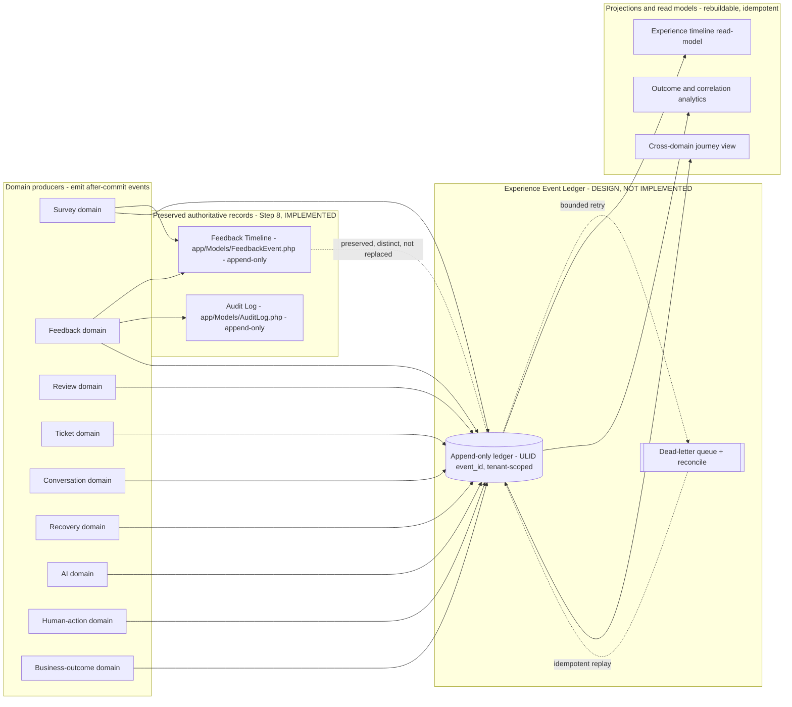

# Experience Event Ledger Architecture (Step 9 Design Baseline)

**Status: DESIGN BASELINE — NOT IMPLEMENTED**

**Sprint: Step 9**

**Owner domain: Analytics & Outcome Ledger**

**Related: ADR 0065 (Experience Event Ledger and relationship to the Step 8 immutable timeline), rule 34, AFR-220..AFR-224**

**Canonical repo: makemesick91-code/aish_agentic_ai**

---

## 1. Purpose and scope

This document is the Step 9 **design baseline** for the **Experience Event Ledger** — a
wider, append-only, cross-domain event stream that will eventually record survey,
feedback, review, ticket, conversation, recovery, AI, human-action, and business-outcome
events for the Aish Agentic AI platform.

Step 9 is a **design/governance sprint**. This document defines contracts, invariants,
and boundaries. It does **not** implement production code, migrations, jobs, or read
models. No ledger table, model, or projection exists yet.

Truthful status:

- The **Experience Event Ledger** as described here is `DESIGN — NOT IMPLEMENTED`.
- The wider cross-domain ledger capability is `NOT STARTED`.
- The **Step 8 Feedback Timeline** (`app/Models/FeedbackEvent.php`) already exists,
  is authoritative for feedback-item lifecycle, and **MUST be preserved** — this design
  neither replaces nor destructively migrates it.

## 2. Ground truth — what already exists (preserve, do not replace)

The following are **already implemented** and remain authoritative. The ledger design
builds beside them, never over them:

- **Immutable Feedback Timeline** — `app/Models/FeedbackEvent.php`: append-only, no
  `updated_at`, update/delete blocked at the model layer. This is the source of truth
  for feedback-item lifecycle events (state transitions, assignment, tags, notes,
  attachments).
- **Append-only audit** — `app/Models/AuditLog.php`: sanitized, append-oriented,
  not deletable.
- **Idempotent feedback projection** — `app/Feedback/FeedbackProjector.php`, enforced by
  the database unique constraint `(tenant_id, source_type, source_id)`, driven from the
  after-commit domain event `app/Events/SurveyResponseCompleted.php` via the queued
  listener `app/Feedback/Listeners/ProjectFeedbackOnSurveyResponseCompleted.php`.
- **Transactional/outbox and idempotency patterns** — established architecture (ADRs
  0016/0017; AFR-031..036). A **generic** experience event ledger does **not** exist yet;
  it will reuse these patterns rather than inventing new ones.

## 3. Event identity

- Every ledger event **MUST** carry a globally unique `event_id` generated as a **ULID**
  (lexicographically sortable, time-prefixed, collision-resistant).
- `event_id` **MUST** be assigned by the producer at emit time and **MUST NOT** change.
- Public/external route keys (if any read surface exposes them) **MUST** use the ULID,
  never a sequential integer id.
- `event_id` uniqueness is enforced by a database unique index; a duplicate insert
  **MUST** be a no-op resolving to the same row (see idempotency, §7).

## 4. Tenant and branch context

- `tenant_id` **MUST** be present on **every** ledger row; there is **no** cross-tenant
  event and no untenanted event. An event without a validated tenant context **MUST**
  fail closed at emit time.
- `branch_id` **MUST** be present when the source domain is branch-scoped and **MAY** be
  null when the event is tenant-global.
- A branch-restricted consumer **MUST** see only events for its branch scope; the ledger
  **MUST NOT** allow a query that returns another tenant's or another branch's events.

## 5. Subject and actor identity

- **Subject identity** — `subject_type` + `subject_ref` identify the customer/subject the
  event is *about* (for example a customer reference, a feedback item, a review, a ticket).
  `subject_ref` **MUST** be a stable opaque reference, never free-text personal content.
- **Actor identity** — `actor_type` ∈ {`system`, `user`, `platform`, `public`} plus a
  sanitized `actor_ref`. The public actor is used for anonymous/public-plane events and
  **MUST NOT** carry tenant RBAC identity.
- Actor and subject fields **MUST** be sanitized: no names, no contact details, no medical
  data, no secrets/tokens (see §9).

## 6. Source domain, event type, and schema version

- Each event **MUST** declare `source_domain` (for example `survey`, `feedback`, `review`,
  `ticket`, `conversation`, `recovery`, `ai`, `human_action`, `business_outcome`).
- Each event **MUST** declare a **typed, versioned** `event_type` name and an integer
  `schema_version`. Event names are stable identifiers (for example
  `feedback.item.state_changed`) — never free-form strings.
- The `(source_domain, event_type, schema_version)` triple selects the payload contract
  used to validate the event. An unknown triple **MUST** fail closed (rejected, not
  silently stored).

## 7. Time model, idempotency, correlation, and causation

### 7.1 occurred_at vs recorded_at

- `occurred_at` — when the event actually happened in the source domain (may be earlier
  than storage; may arrive late).
- `recorded_at` — when the ledger durably persisted the event.
- The two are **distinct** and both **MUST** be stored. The design is **clock-skew
  tolerant**: `occurred_at` may be before or after another event's `recorded_at`, and
  consumers **MUST NOT** assume `occurred_at` reflects arrival order.

### 7.2 Idempotency key

- Each producer **MUST** supply an `idempotency_key` unique per logical event within its
  producer scope. Replays, retries, and duplicate deliveries with the same key **MUST**
  resolve to the same ledger row (dedupe on replay), enforced by a unique constraint on
  `(tenant_id, producer, idempotency_key)`.

### 7.3 Correlation and causation

- `correlation_id` groups all events belonging to one logical workflow across domains
  (for example a single customer experience journey from survey to recovery outcome).
- `causation_id` references the `event_id` of the direct upstream event that caused this
  one, forming a traceable cause chain.
- Both **MUST** be propagated through queued jobs and cross-domain producers so a workflow
  can be traced end to end.

## 8. Ordering guarantees and non-guarantees

- **Guaranteed:** per-subject monotonic ordering by `recorded_at` — for a given
  `(tenant_id, subject_ref)` the ledger presents events in stable, non-decreasing
  `recorded_at` order, tie-broken by ULID `event_id`.
- **Not guaranteed:** there is **no global total order** across subjects or tenants, and
  no guarantee that `occurred_at` is monotonic even within one subject.
- Consumers **MUST** tolerate out-of-order `occurred_at` and **MUST NOT** rely on global
  sequence numbers. Any ordering-sensitive projection **MUST** derive order from
  `recorded_at` within a subject, not from arrival.

## 9. Payload minimization, PII classification, and redaction

- Payloads **MUST** be minimized to the fields a downstream projection genuinely needs.
- The following **MUST NEVER** appear in a ledger payload: free-text survey/feedback answer
  content, medical/clinical data, secrets, tokens, passwords, credentials, or raw customer
  contact details.
- Every payload field **MUST** be classified — for example `PUBLIC`, `INTERNAL`, `PII`,
  `SENSITIVE` — and `PII`/`SENSITIVE` fields **MUST** be redacted or referenced by opaque
  id rather than stored inline.
- Free text is untrusted: it is escaped on output, is **not** AI-fed at this layer, and is
  referenced (via the authoritative source record) rather than copied into the ledger.

## 10. Retention and legal hold

- Each `source_domain`/`event_type` **MUST** carry a documented retention class; retention
  is tenant-configurable within governance bounds.
- A **legal hold** flag **MUST** suspend retention-driven deletion for the affected subject
  or correlation scope until the hold is lifted.
- Retention enforcement **MUST** be auditable and **MUST NOT** silently delete events under
  active hold. Deletion for retention is a governed lifecycle action, distinct from the
  prohibited update/delete at the model layer (§12).

## 11. Replay and projection semantics

- Projections and read models built from the ledger **MUST** be **rebuildable** purely by
  replaying ledger events — the ledger is the durable source, projections are derived.
- Delivery is **at-least-once**; therefore all consumers **MUST** be **idempotent** —
  reprocessing the same `event_id` **MUST NOT** double-count or create duplicate side
  effects.
- A rebuild **MUST** be deterministic: replaying the same events yields the same read-model
  state.

## 12. Immutable / append-only behavior

- The ledger is **append-only**: no `updated_at`, and update/delete **MUST** be blocked at
  the model layer, mirroring the Step 8 timeline guarantees in `app/Models/FeedbackEvent.php`
  and `app/Models/AuditLog.php`.
- Corrections are expressed as **new compensating events**, never by mutating a stored
  event. History is permanent and traceable.

## 13. Dead-letter and failure reconciliation

- Emission and consumption **MUST** use **bounded retry** with backoff.
- Exhausted retries **MUST** route to a **dead-letter queue (DLQ)** with a sanitized failure
  reason (no payload secrets).
- A **reconcile command** (design placeholder `aish:experience-ledger-reconcile`) **MUST**
  be idempotent and safe to rerun, replaying DLQ entries and back-filling any gap without
  creating duplicates. It **MUST NOT** be an uncontrolled second write path.

## 14. Backfill source markers

- Backfilled rows (imported from an existing domain source rather than a live event)
  **MUST** be marked distinctly (for example `origin = backfill` plus a `backfill_batch`
  marker) so analytics can distinguish live capture from historical import.
- Backfill **MUST** be **idempotent and resumable** — reusing the producer idempotency key
  so a re-run resolves to existing rows — and **MUST NOT** overwrite live events.

## 15. Schema evolution

- Schema changes **MUST** be **additive** and **versioned**: a new `schema_version` for a
  changed payload, never a destructive rewrite of stored events.
- Producers and consumers **MUST** be forward/backward tolerant — a consumer ignores unknown
  additive fields and applies sane defaults for missing optional fields.
- Removing or repurposing a field **MUST** be a new event version, and old versions remain
  readable. There **MUST NOT** be an in-place migration that rewrites historical payload
  meaning.

## 16. Query and indexing boundaries

- Every query **MUST** be tenant-scoped; there is **no** cross-tenant read path.
- Baseline indexes: `(tenant_id, subject_ref, occurred_at)` for per-subject timelines and
  `(tenant_id, correlation_id)` for workflow tracing, plus the unique indexes on `event_id`
  and `(tenant_id, producer, idempotency_key)`.
- Search/index infrastructure **MUST** stay inside the tenant boundary; no unscoped external
  index that could leak across tenants.

## 17. Relationship to the Step 8 Feedback Timeline

The Experience Event Ledger **does not replace and does not own** feedback-item state:

- The **Feedback Timeline** (`app/Models/FeedbackEvent.php`) remains the **authoritative
  source of truth** for feedback-item lifecycle (state transitions, assignment, tags,
  notes, attachments). It is **preserved, distinct, and never destructively migrated**.
- The **Ledger** is a **wider cross-domain append-only stream**. It **may project FROM**
  domain events — including feedback domain events emitted alongside timeline writes — into
  a unified analytics stream, but it **MUST NOT** become the owner of feedback-item state
  and **MUST NOT** be treated as the feedback lifecycle record.
- Feedback lifecycle reads continue to use the Feedback Timeline. Cross-domain analytics and
  outcome correlation use the Ledger. The two coexist: one authoritative per-domain record,
  one derived cross-domain stream.

The dashed link marks that the Feedback Timeline stays authoritative and separate; the
ledger observes/projects from the same domain events but does not subsume the timeline.

## 18. Out of scope for Step 9

Step 9 **MUST NOT** deliver, and this document explicitly excludes:

- Any ledger migration, model, table, or unique constraint (design only).
- Any producer wiring, queued listener, projection job, or read model.
- Any DLQ, reconcile command, or backfill implementation.
- Any change to the Step 8 Feedback Timeline, its model, or its projection.
- AI processing of ledger payloads, recovery/SLA logic, Google review sync, or deployment.

## 19. What Step 10+ implements

Subsequent steps (Step 10 and beyond), each under their own ADR, rule, GO/WATCH/NO-GO gate,
and clean-checkout verification, will implement:

- The append-only ledger table and model honoring §3–§16 invariants.
- Producer adapters emitting versioned events from each source domain via after-commit
  domain events and the established outbox pattern.
- Idempotent, rebuildable projections and tenant-scoped read models.
- The DLQ, the idempotent `aish:experience-ledger-reconcile` command, and idempotent
  resumable backfill with distinct source markers.
- Retention/legal-hold enforcement and schema-evolution tooling.

All of the above remain **NOT STARTED**; this document is the governing design baseline
only.
