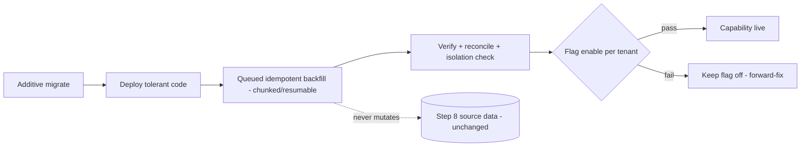

# Migration, Compatibility & Progressive-Rollout Strategy (Step 9 → Step 10+)

**Status:** DESIGN BASELINE — NOT IMPLEMENTED (no migration is run in Step 9)
**Sprint:** Step 9 — Competitive Gap Audit & Architecture Re-baseline
**Owner domain:** Cross-cutting (data platform)
**Related:** ADR 0068 (Additive migration, backfill, reconciliation, progressive rollout), rule 34, AFR-235..AFR-238;
`docs/operations/BACKUP_RESTORE_BASELINE.md`; rules 23, 26, 29
**Canonical repo:** makemesick91-code/aish_agentic_ai

---

## 1. Non-negotiable principles

1. **Additive migrations only** by default. New tables/columns/indexes; no destructive alteration of Step 8 schema.
2. **Existing Step 8 records remain valid** and readable unchanged after every migration.
3. **No migration-history reset.** The 39 existing migrations under `database/migrations/` are immutable history;
   Step 10+ appends new dated migrations.
4. **No destructive production backfill.** Backfills are additive and reversible; they never mutate or delete source
   rows.
5. **Idempotent, queued, resumable backfill.** Re-running a backfill produces the same result and never double-writes.
6. **Truthful status.** No migration/backfill is claimed complete without evidence; partial progress is reported
   truthfully.

---

## 2. Migration contract

- **Additive schema:** each new domain (Customer 360 first) adds its own tables with `tenant_id` (and `branch_id`
  where branch-scoped), ULID public ids, and tenant-scoped indexes. Foreign keys to existing tables are additive and
  nullable during transition.
- **Idempotent queued backfill:** backfill jobs are chunked, resumable (checkpoint/cursor persisted), and idempotent
  (guarded by unique keys, e.g. the Customer 360 deterministic identity key). A crash resumes from the last
  checkpoint; a rerun is a no-op for already-processed rows.
- **Chunking & resumability:** bounded batch sizes; a persisted cursor; backpressure against queue depth; a maximum
  in-flight budget per tenant to protect isolation.
- **Progress & failure visibility:** every backfill exposes processed/total/failed counts, last cursor, and a
  dead-letter list; failures are inspectable and re-drivable (mirrors `aish:feedback-reconcile`).
- **Shadow projection:** where useful (Customer 360 read-model, Experience Event Ledger projections), build a shadow
  read-model first, verify parity against source, then cut over behind a flag — never a blind swap.
- **Feature flags:** each new capability is flag-gated per tenant; default off; enabled only after its backfill and
  verification pass. A flag is a truthful state, not a claim of production readiness.
- **Reconciliation commands & reports:** every backfilled projection has an `aish:*-reconcile` command that is
  idempotent, safe to rerun, and emits a report; reconciliation is a controlled second read path, never an
  uncontrolled write path (mirrors rule 33 projection rules).
- **Rollback & forward-fix criteria:** additive migrations roll back by dropping the new, unused structures (no data
  loss to Step 8). A backfill rolls back by disabling the flag and, if needed, tombstoning derived rows; source data
  is untouched. Forward-fix is preferred once a capability is live and referenced.
- **Deployment ordering:** migrate (additive) → deploy code that tolerates both old and new shape → backfill (queued)
  → verify/reconcile → enable flag. Never enable a flag before its backfill+verification.
- **Mixed-version tolerance:** deployed code tolerates rows that are not yet backfilled (nullable links, "unlinked"
  states) so a rolling deploy never breaks; readers degrade gracefully.
- **Backup & restore requirements:** a tested restore precedes any pilot/production backfill
  (`docs/operations/BACKUP_RESTORE_BASELINE.md`; rule 11); a backup is taken before a large backfill.
- **Performance budget:** backfills run within a stated per-tenant throughput budget and off-peak windows; they must
  not degrade live tenant traffic or violate isolation.
- **Tenant-isolation verification:** every backfill is tenant-scoped; a post-backfill isolation check proves no
  cross-tenant row was written (extends the cross-tenant test matrix).

---

## 3. Step 8 preservation guarantees

- `feedback_items`, `feedback_events`, and audit rows are never altered or deleted by Customer 360 or ledger work.
- Feedback items link to a `customer_id` only where a deterministic identity exists; otherwise they remain unlinked
  and fully functional.
- The immutable Feedback Timeline stays authoritative; ledger projections are additive and rebuildable.

## 4. Rollout diagram

## 5. Out of scope for Step 9

No migration, backfill, flag, or reconcile command is created in Step 9. This is the contract Step 10 (Customer 360)
and later waves execute against.
