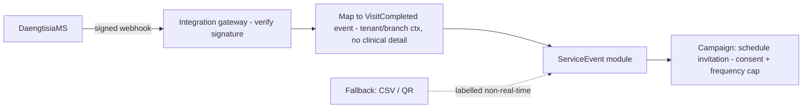

# DaengtisiaMS Event Integration Architecture — Aish Agentic AI

**Status:** ARCHITECTURE BASELINE (Step 3) · **Application implementation: NOT STARTED.**
**Canonical:** Master Source v2.3.0 §34, §35, §39 · PRD v1.2.0 §10.5 · **Rules:** `.claude/rules/03`, `04`, `17`, `20` ·
**ADR:** [0016](../decisions/adr/0016-domain-events-outbox-idempotency-retry-dead-letter.md), [0017](../decisions/adr/0017-public-api-and-webhook-contracts.md) ·
Builds on Step 2 [DAENGTISIAMS_EVENT_CONTRACT_BASELINE](DAENGTISIAMS_EVENT_CONTRACT_BASELINE.md).

## Trigger
`VisitCompleted` from the clinic management system is the preferred pilot trigger. Integration **prefers a
signed/authenticated API/webhook**; controlled CSV/manual import and on-site QR are temporary fallbacks shown
truthfully in analytics/audit and **not** presented as real-time integration success (`.claude/rules/17`).

## Ingestion path (planned)

## Data minimization
The event carries only what is needed to schedule an invitation (tenant, branch, visit reference, timestamp,
consented contact). **No clinical/medical detail** crosses the boundary (`.claude/rules/18`). Payloads are
untrusted and never determine tool/behaviour.

## Reliability
Signed + replay-protected + idempotent; retries never create duplicate invitations; dead-letter + replay;
truthful states. Manual fallback keeps the workflow usable if the integration is unavailable (UC-P0-16).

## Assertion
No DaengtisiaMS connection, webhook, or import runs in Step 3; the contract is a planned baseline.
