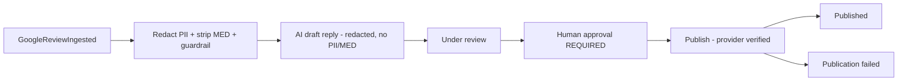

# Google Business Profile Integration Architecture — Aish Agentic AI

**Status:** ARCHITECTURE BASELINE (Step 3) · **Application implementation: NOT STARTED.** Google readiness UNVERIFIED (OD-08).
**Canonical:** Master Source v2.3.0 §16, §38 · PRD v1.2.0 §11.2, §17 · **Rules:** `.claude/rules/06`, `18`, `20` ·
**ADR:** [0021](../decisions/adr/0021-google-business-profile-integration-boundary.md), [0022](../decisions/adr/0022-oauth-credential-encryption.md).

## Boundary
Google is isolated behind an Integration-module adapter; the **Reputation** module owns domain logic
(connections, locations, reviews, reply drafts/approvals/publishes). All sync/publish go through the outbox
(idempotent, provider-verified).

## OAuth & credentials
OAuth state validated; access tokens encrypted at rest; refresh tokens never plaintext; rotation supported;
tenant can disconnect and delete credentials (ADR 0022). Google credentials are per-tenant, never shared.

## Review reply workflow (planned)

## Policy safety (permanent, `.claude/rules/06`)
No gating/manipulation: never route only satisfied customers, block by CSAT/sentiment, request a specific
rating, incentivize positive reviews, or fake reviews. Equal access for all eligible customers. Replies are
professional, non-defensive, disclose no personal/medical/sensitive-transaction data; sensitive cases route to a
private channel. Every reply is human-approved. Auto-publish is prohibited outside Master Source §16.4.

## Truthful states & readiness
Reply-state vocabulary per `.claude/rules/10`. A mock/unavailable Google integration is labelled truthfully and
may be `BLOCKED`. Current Google policy/API **must be re-verified** before any real integration (OD-08).

## Assertion
No Google OAuth, review sync, or reply publish runs in Step 3.
