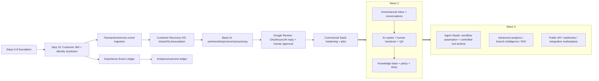

# Aish Agentic Experience OS — Wave 1–3 Roadmap (Step 9 Lock)

**Status:** ROADMAP LOCK — governance baseline; all waves are PLANNED (NOT STARTED) except Steps 5–8 foundation
**Sprint:** Step 9 — Competitive Gap Audit & Architecture Re-baseline
**Related:** `docs/product/AGENTIC_EXPERIENCE_OS_PRD_ADDENDUM.md`, `docs/product/competitive/STEP_9_COMPETITIVE_GAP_REGISTER.md`,
`docs/planning/STEP_10_CUSTOMER_360_IMPLEMENTATION_CONTRACT.md`, rule 34, Master Source §75
**Canonical repo:** makemesick91-code/aish_agentic_ai

---

## 1. Positioning

**Aish Agentic AI** is the product; **Aish Agentic Experience OS** is the commercial positioning: one tenant-isolated,
audited, human-approval-governed platform that unifies survey/CSAT → feedback operations → customer recovery →
reputation → Customer 360 → agentic AI for multi-branch businesses. The differentiator is **integrated, governed value
across the customer lifecycle**, not feature parity with any single point tool.

Positioning MUST NOT be reduced to a survey app, review generator, chatbot, or Google Review tool (rule 22). No
"fully autonomous" or guaranteed-rating claim is permitted (rule 22).

---

## 2. Delivered foundation (Steps 5–8) — the substrate the waves build on

Runtime bootstrap; SaaS core (identity, tenant/branch, RBAC, audit, isolation); notification/subscription/platform-admin
skeletons; survey + CSAT/NPS/CES; feedback operations inbox. See `docs/product/capability-inventory/STEP_9_CAPABILITY_INVENTORY.md`.

---

## 3. Dependency-locked wave order

The order is a **dependency lock**, not a preference. Each item starts only after its dependencies are merged and
GO-tagged. Autonomy is never scheduled before manual/semi-automated workflows are stable (rules 02/05).

### Wave 1 — Governed customer-lifecycle core (next)
1. **Customer 360 & identity resolution** — Step 10 (the immediate next step; contract in `docs/planning/STEP_10_CUSTOMER_360_IMPLEMENTATION_CONTRACT.md`).
2. Transaction / service-event ingestion.
3. Experience Event Ledger (append-only cross-domain stream; preserves the Step 8 timeline).
4. Customer Recovery OS — recovery tickets, SLA, assignment, escalation, playbooks.
5. Basic AI — sentiment/topic/severity/summary over feedback (governed by rules 05/18; MED excluded; human approval
   for risky).
6. Google Review & reputation — OAuth, sync, AI reply draft + human approval + publish (anti-gating permanent).
7. Analytics — owner/branch dashboards + outcome measurement (on the ledger).
8. Commercial SaaS hardening + first pilot (Klinik Gigi Daengtisia; rule 16). Payment remains out of scope.

### Wave 2 — Omnichannel & assisted AI
9. Omnichannel inbox & conversations (WhatsApp/email/web/social/SMS/voice adapters; provider degradation must not break
   core).
10. AI copilot + human handover + conversation QA.
11. Knowledge base + policy controls + tenant/branch-scoped RAG.

### Wave 3 — Agentic automation & platform scale
12. Agent Studio — workflow automation + controlled, allowlisted tool actions (autonomy only after Wave 1/2 stable).
13. Advanced analytics / branch intelligence / predictive insight.
14. Public API / webhooks / integration marketplace.

**Explicitly deferred (out of MVP scope, Master Source §48):** payment/invoicing/tax/dunning; AI
auto-refund/compensation; fully autonomous complaint handling; auto-publish of all replies; voice agent as a Wave-1
item.

---

## 4. Wave gates

Each wave item is its own step with: a Master Source update, a rule where it establishes new invariants, ADR(s), a
GO/WATCH/NO-GO gate, a `verify-*` mechanism, clean-checkout verification, an immutable GO tag, and a GitHub Release.
Pilot expansion requires all hard safety gates passing (rule 19). Observability + tested restore precede pilot
(rule 26).

## 5. Truthful status

Every wave item is **NOT STARTED** until evidenced. This roadmap is a plan, not an implementation, and the Step 9 GO
tag attests governance/architecture readiness only — not implementation, deployment, pilot, or production readiness,
and not that any domain is owned or infrastructure provisioned.
